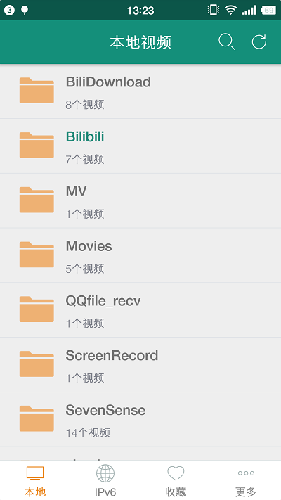
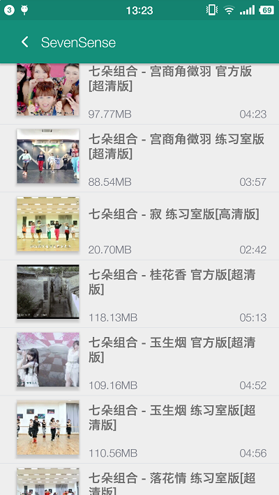
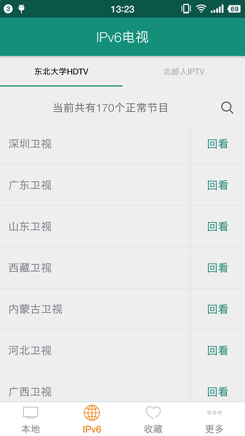

# XDPlayer - 多功能视频播放器

> Demo APK下载：[点击下载 XDPlayer v1.6.0](https://github.com/liying2008/XDPlayer/releases/download/v1.6.0/xdplayer_1.6.0_fir.apk)

编译环境
----
- Android Studio 2.3.3  
- Gradle 3.3  

主要功能
----
『XDPlayer』是一款多功能的视频播放器。既可以用作本地视频播放器，也可以用来观看IPv6电视。您还可以将喜欢的视频收藏起来，方便以后观看。   
 
屏幕截图
----

更新日期
----
2017-6-21    

更新详情
----
【新增】新增下载Bilibili视频封面功能；  
【修复】修复北邮人IPTV无法获取节目的问题；  
【修复】其他问题修复。   

联系作者
----
新浪微博：[@独毒火](http://weibo.com/neuliying)  
邮箱：[liruoer2008@yeah.net](mailto:liruoer2008@yeah.net)

感谢
----
- [VitamioBundleStudio](https://github.com/yixia/VitamioBundleStudio)  
- [ViewPagerIndicator](https://github.com/LuckyJayce/ViewPagerIndicator) 
- [jsoup](https://jsoup.org/)  
- [glide](https://github.com/bumptech/glide)
- [FlycoDialog_Master](https://github.com/H07000223/FlycoDialog_Master)
- [FileDownloader](https://github.com/lingochamp/FileDownloader)
- [ApplicationToast](https://github.com/liying2008/ApplicationToast)

License
----
  
	Copyright 2016-2017 LiYing
	
	Licensed under the Apache License, Version 2.0 (the "License");
	you may not use this file except in compliance with the License.
	You may obtain a copy of the License at
	
	   http://www.apache.org/licenses/LICENSE-2.0
	
	Unless required by applicable law or agreed to in writing, software
	distributed under the License is distributed on an "AS IS" BASIS,
	WITHOUT WARRANTIES OR CONDITIONS OF ANY KIND, either express or implied.
	See the License for the specific language governing permissions and
	limitations under the License.

